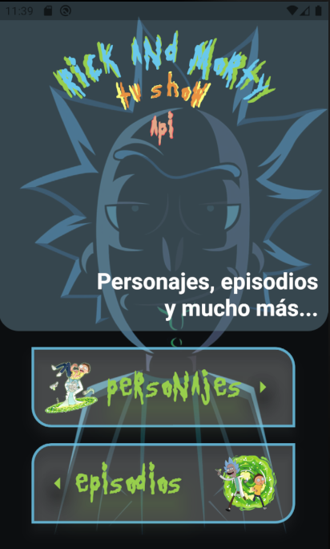
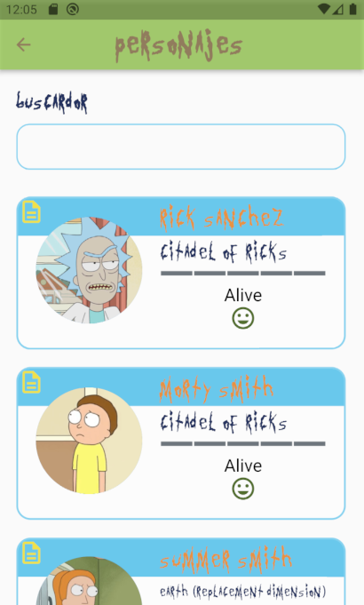
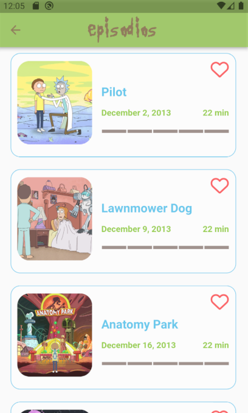

# Rick and Morty - API

> ### Getting Started

The Boilerplate contains the minimal implementation required to create a new library or project. The repository code is preloaded with some basic components like basic app architecture, app theme, constants and required dependencies to create a new project. By using boiler plate code as standard initializer, we can have same patterns in all the projects that will inherit it. This will also help in reducing setup & development time by allowing you to use the same code pattern and avoid re-writing from scratch.

> ## How to Use 

**Step 1:**
- Download or clone this repo by using the link below:
```
SSH: git@github.com:jorgecasanovadev/rick_and_morty_api.git
HTTPS: https://github.com/jorgecasanovadev/rick_and_morty_api.git
```

**Step 2:**
- Go to the project root and execute the following command in the console to get the required dependencies: 
🧙🏼‍♂️
```
flutter clean
flutter pub get 
```

**Step 3:**
- This project works with code generation, execute the following command to generate files:
```
flutter packages pub run build_runner build --delete-conflicting-outputs
```

> ## SDK Version
```dart
jorgecasanova ~ % flutter --version
Flutter 3.10.5 • channel stable • https://github.com/flutter/flutter.git
Framework • revision 796c8ef792 (8 weeks ago) • 2023-06-13 15:51:02 -0700
Engine • revision 45f6e00911
Tools • Dart 3.0.5 • DevTools 2.23.1

jorgecasanova ~ % flutter doctor
Doctor summary (to see all details, run flutter doctor -v):
[✓] Flutter (Channel stable, 3.10.5, on macOS 13.5 22G74 darwin-arm64, locale en-US)
[✓] Android toolchain - develop for Android devices (Android SDK version 34.0.0)
[✓] Xcode - develop for iOS and macOS (Xcode 14.3.1)
[✓] Chrome - develop for the web
[✓] Android Studio (version 2022.2)
[✓] VS Code (version 1.81.0)
[✓] Connected device (3 available)
[✓] Network resources

• No issues found!
```

> ## Screenshot Screens
### Home Screen


<p align="left" alt="home-screen-content">
  Flutter provides a lot of flexibility in deciding how to organize and architect
your apps. While this freedom is very valuable, it can also lead to apps with
large classes, inconsistent naming schemes, as well as mismatching or missing
architectures. These types of issues can make testing, maintaining, and extending
your apps difficult.
</p>
<br>

### Character Screen


<p align="left" alt="characters-screen-content">
  Flutter provides a lot of flexibility in deciding how to organize and architect
your apps. While this freedom is very valuable, it can also lead to apps with
large classes, inconsistent naming schemes, as well as mismatching or missing
architectures. These types of issues can make testing, maintaining, and extending
your apps difficult.
</p>
<br>


### Episodes Screen


<p align="left" alt="episodes-screen-content">
  Flutter provides a lot of flexibility in deciding how to organize and architect
your apps. While this freedom is very valuable, it can also lead to apps with
large classes, inconsistent naming schemes, as well as mismatching or missing
architectures. These types of issues can make testing, maintaining, and extending
your apps difficult.
</p>
<br>


This project is a starting point for a Flutter application.

A few resources to get you started if this is your first Flutter project:

- [Lab: Write your first Flutter app](https://docs.flutter.dev/get-started/codelab)
- [Cookbook: Useful Flutter samples](https://docs.flutter.dev/cookbook)

For help getting started with Flutter development, view the
[online documentation](https://docs.flutter.dev/), which offers tutorials,
samples, guidance on mobile development, and a full API reference.
